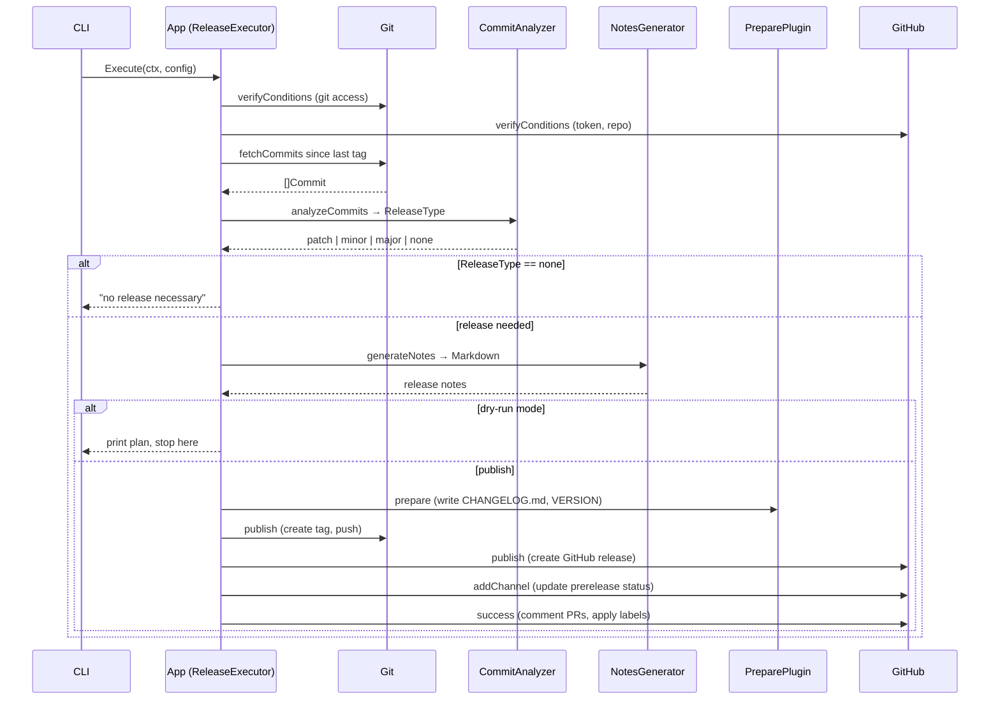
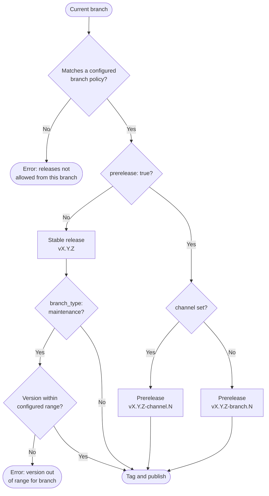
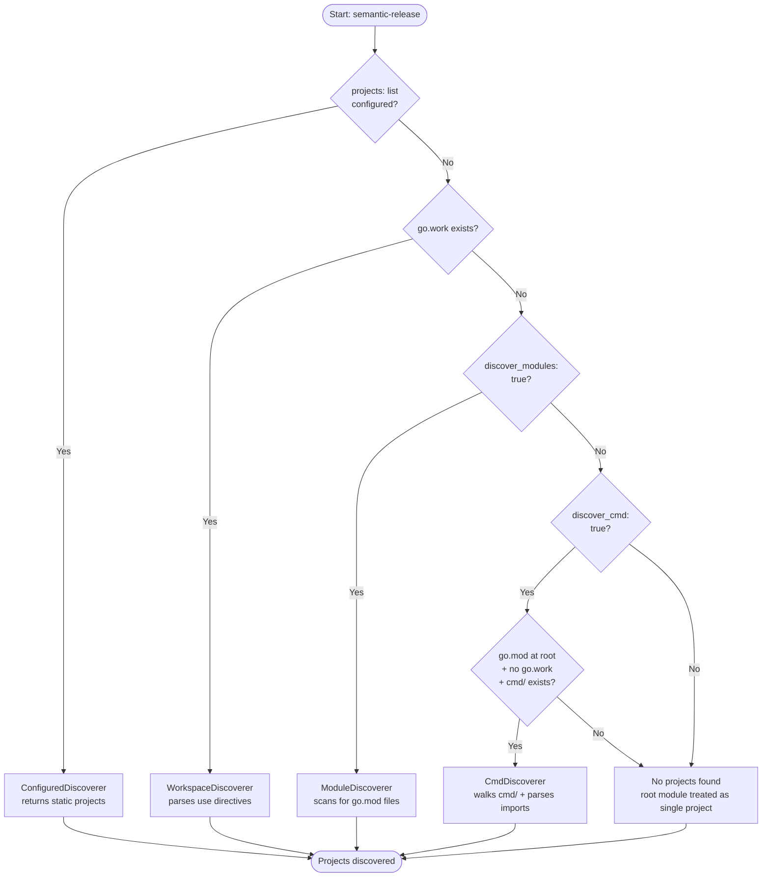
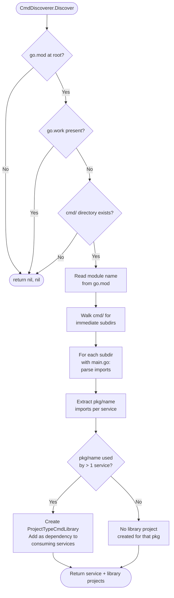
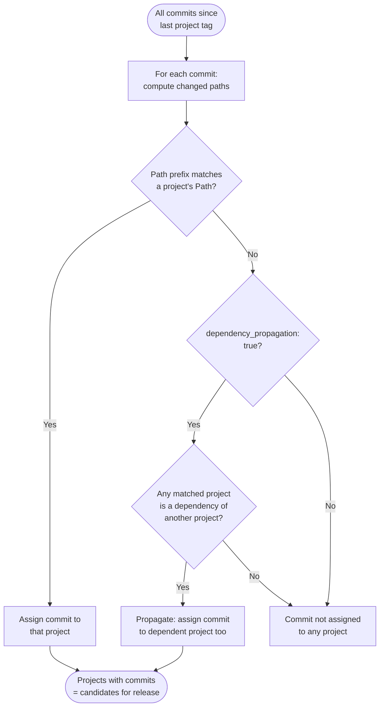
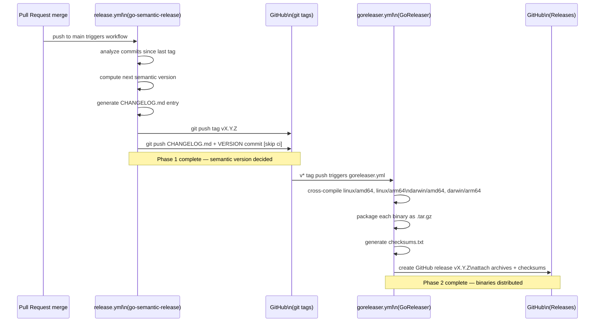

# semantic-release

[](https://github.com/jedi-knights/go-semantic-release/actions/workflows/ci.yml)
[](https://github.com/jedi-knights/go-semantic-release/actions/workflows/release.yml)
[](https://github.com/jedi-knights/go-semantic-release/actions/workflows/goreleaser.yml)
[](https://github.com/jedi-knights/go-semantic-release/actions/workflows/badge.yaml)
[](https://jedi-knights.github.io/go-semantic-release/?v=10)

A production-grade semantic release utility written in native Go. Analyzes conventional commits, determines the next semantic version, generates changelogs, creates tags, and publishes GitHub releases.

Supports monorepos with independent project versioning, including Go workspaces and multi-module repositories.

## Table of Contents

- [Features](#features)
- [Installation](#installation)
- [Quick Start](#quick-start)
- [Usage](#usage)
- [Configuration](#configuration)
- [Release Candidate Workflows](#release-candidate-workflows)
- [Architecture](#architecture)
- [Release Pipeline](#release-pipeline)
- [Development](#development)
- [Roadmap](#roadmap)
- [References](#references)
- [License](#license)

## Features

- **Conventional Commits analysis** — parses commit messages to determine release types (major, minor, patch)
- **Semantic versioning** — calculates next version based on commit impact
- **Monorepo support** — independent versioning per project with four discovery modes:
  - Go workspaces (`go.work`)
  - Multiple nested `go.mod` modules
  - `cmd/` layout single-module monorepos (service + shared library detection)
  - Config-defined projects with path mappings
- **Branch policies** — stable releases on main, prereleases on beta/alpha/next
- **Changelog generation** — Markdown release notes grouped by commit type
- **GitHub Releases** — creates releases via the GitHub API
- **Dry-run mode** — preview releases without any mutations
- **Dependency propagation** — optionally trigger dependent project releases
- **Pluggable architecture** — ports and adapters pattern for full extensibility

## Installation

```bash
go install github.com/jedi-knights/go-semantic-release/cmd/semantic-release@latest
```

Or build from source:

```bash
git clone https://github.com/jedi-knights/go-semantic-release.git
cd go-semantic-release
go build -o bin/semantic-release ./cmd/semantic-release
```

## Quick Start

```bash
# Initialize config
semantic-release config init

# Perform a release (default action, same as original semantic-release)
semantic-release

# Dry run
semantic-release --dry-run

# See what would happen (extended command)
semantic-release plan

# Preview the next version
semantic-release version

# Generate changelog
semantic-release changelog
```

## Usage

Running `semantic-release` with no subcommand performs the release — this matches the original [semantic-release](https://github.com/semantic-release/semantic-release) behavior exactly.

```bash
semantic-release [options]
```

### CLI Flags (compatible with semantic-release)

| Flag | Short | Description |
|------|-------|-------------|
| `--branches` | `-b` | Git branches to release from |
| `--repository-url` | `-r` | Git repository URL |
| `--tag-format` | `-t` | Git tag format |
| `--plugins` | `-p` | Plugins |
| `--extends` | `-e` | Shareable configurations |
| `--dry-run` | `-d` | Skip publishing |
| `--ci` | | Toggle CI verifications |
| `--no-ci` | | Skip CI verifications |
| `--debug` | | Output debugging information |

### Extension Flags (Go-specific)

| Flag | Description |
|------|-------------|
| `--config` | Path to config file (default: `.semantic-release.yaml`) |
| `--project` | Target a specific project in a monorepo |
| `--json` | Output in JSON format |
| `--interactive` | Prompt for confirmation before releasing |
| `--no-interactive` | Disable interactive prompts (always proceed without confirmation) |

### Extension Subcommands

These are additional commands beyond the original semantic-release:

| Command | Description |
|---------|-------------|
| `semantic-release plan` | Show the release plan without executing |
| `semantic-release version` | Display current and next version |
| `semantic-release changelog` | Generate release notes |
| `semantic-release detect-projects` | List discovered projects |
| `semantic-release verify` | Check release prerequisites |
| `semantic-release lint` | Lint recent commit messages against conventional commit rules |
| `semantic-release config init` | Create a default config file |

## Configuration

Configuration is loaded from `.semantic-release.yaml`, `.releaserc.yaml`, `.releaserc.json`, or `release.config.yaml`, plus environment variables (prefix `SEMANTIC_RELEASE_`), and CLI flags. CLI flags take precedence over config files.

When not running in CI, dry-run mode is enabled by default. Use `--no-ci` to run locally without dry-run.

### Repository-wide release (default)

```yaml
release_mode: repo
tag_format: "v{{.Version}}"
```

### Independent project versioning

```yaml
release_mode: independent
project_tag_format: "{{.Project}}/v{{.Version}}"

projects:
  - name: api
    path: services/api
    tag_prefix: "api/"
  - name: worker
    path: services/worker
    tag_prefix: "worker/"
    dependencies:
      - shared
  - name: shared
    path: pkg/shared
    tag_prefix: "shared/"

dependency_propagation: true
```

### Auto-discovery with go.work

```yaml
release_mode: independent
# Projects are auto-discovered from go.work
```

### Auto-discovery with nested go.mod

```yaml
release_mode: independent
discover_modules: true
```

### Auto-discovery with cmd/ layout (single-module monorepo)

Use this mode when you have a single `go.mod` at the root (no `go.work`) with
`cmd/<service>/main.go` entry points — a common pattern in Go monorepos at scale.

```yaml
release_mode: independent
discover_cmd: true
```

The discoverer walks `cmd/` and creates one `cmd-service` project per immediate
subdirectory that contains a `main.go`. It also parses each `main.go`'s imports:
any `pkg/<name>` sub-package imported by **more than one** service becomes a
`cmd-library` project and is automatically listed as a dependency of all
consuming services.

**Example layout:**

```
repo/
├── go.mod                       # single module: github.com/org/myapp
├── cmd/
│   ├── api/
│   │   └── main.go              # imports pkg/queue → ProjectTypeCmdService "api"
│   └── worker/
│       └── main.go              # imports pkg/queue → ProjectTypeCmdService "worker"
└── pkg/
    └── queue/                   # used by 2 services → ProjectTypeCmdLibrary "queue"
```

**Resulting projects:**

| Name | Path | Type | Tag prefix | Dependencies |
|------|------|------|------------|--------------|
| `api` | `cmd/api` | `cmd-service` | `api/` | `[queue]` |
| `worker` | `cmd/worker` | `cmd-service` | `worker/` | `[queue]` |
| `queue` | `pkg/queue` | `cmd-library` | `queue/` | — |

A `pkg/` package used by only one service is **not** promoted to a separate project — it is treated as an internal detail of that service only.

> **Dependency propagation:** When `dependency_propagation: true` is also set, a commit that touches `pkg/queue` will automatically trigger a release for both `api` and `worker`.

### Branch policies

```yaml
branches:
  - name: main
    is_default: true
  - name: next
    prerelease: true
    channel: next
  - name: next-major
    prerelease: true
    channel: next-major
  - name: beta
    prerelease: true
    channel: beta
  - name: alpha
    prerelease: true
    channel: alpha
```

Maintenance branches (e.g., `1.x`, `1.0.x`) are auto-detected by name pattern. You can also configure them explicitly:

```yaml
branches:
  - name: "1.x"
    range: "1.x"
    channel: "release-1.x"
    branch_type: maintenance
  - name: "1.0.x"
    range: "1.0.x"
    channel: "release-1.0.x"
    branch_type: maintenance
  - name: main
    is_default: true
```

Maintenance branches enforce version range constraints — a `1.0.x` branch only allows patch bumps, and a `1.x` branch allows patch and minor bumps but not major.

### Prepare step (file updates)

```yaml
prepare:
  changelog_file: CHANGELOG.md
  version_file: VERSION
  version_files:
    - pyproject.toml:project.version
    - package.json:version
    - VERSION
  command: "uv lock && uv run invoke generate-catalog"
```

When configured, the prepare step runs before the release is published:

1. **`changelog_file`** — prepends the generated release notes into the named Markdown file. If the file does not exist, it is created with a `# Changelog` header. Path is relative to the repository root.

2. **`version_file`** — writes the new version string (plus a trailing newline) to the named file. Intended for a single `VERSION` file. Path is relative to the repository root.

3. **`version_files`** — list of additional files to update. Each entry is either:
   - A plain file path (e.g. `VERSION`) — the version string is written verbatim, replacing the file contents.
   - A `path:key.path` pair (e.g. `pyproject.toml:project.version`) — the named TOML key inside `[section]` headers is updated in-place while preserving all formatting, spacing, and inline comments.

   ```yaml
   # Plain text — replaces the entire file with "1.2.3\n"
   - VERSION

   # TOML — updates version = "..." under [project]
   - pyproject.toml:project.version

   # TOML — updates version = "..." under [tool.poetry]
   - pyproject.toml:tool.poetry.version
   ```

4. **`command`** — a shell command executed after file updates but before the release is tagged. The environment variable `NEXT_RELEASE_VERSION` is set to the new version string so scripts can reference it:

   ```yaml
   command: "uv lock && uv run invoke generate-catalog"
   ```

   ```bash
   # In a script, reference the version directly:
   echo "Releasing ${NEXT_RELEASE_VERSION}"
   ```

   If the command exits with a non-zero status, the release is aborted.

### Git assets (pre-tag commit)

```yaml
git:
  assets:
    - CHANGELOG.md
    - pyproject.toml
    - VERSION
    - sun_qa_python_tools/STEP_CATALOG.md
    - uv.lock
  message: "chore(release): {{.Version}} [skip ci]\n\n{{.Notes}}"
```

When `git.assets` is non-empty, the release workflow stages those files, commits them, and pushes the branch **before** creating the tag. This ensures the tag always points to the release commit rather than to a commit that predates the updated files.

**`git.assets`** — list of file paths (relative to the repository root) to stage and commit. Typically includes files updated by the prepare step.

**`git.message`** — Go template for the release commit message. Three placeholders are available:

| Placeholder | Description |
|------------|-------------|
| `{{.Version}}` | The new semantic version string (e.g. `1.2.3`) |
| `{{.Tag}}` | The full tag name (e.g. `my-svc/v1.2.3`) |
| `{{.Notes}}` | The generated release notes (Markdown) |

If `message` is empty or fails to render, the commit message defaults to `chore(release): <tag>`.

> **`[skip ci]` convention:** Adding `[skip ci]` to the commit message prevents CI pipelines from re-triggering on the release commit, which is the standard pattern for automated release commits.

### Git identity

```yaml
git_author:
  name: semantic-release-bot
  email: semantic-release-bot@users.noreply.github.com
```

### GitHub settings

```yaml
github:
  create_release: true
  owner: jedi-knights
  repo: go-semantic-release
  draft_release: false
  assets:
    # Simple form — filename becomes the download label on the release page
    - "dist/*.tar.gz"
    - "dist/*.zip"
    # Structured form — custom label shown on the release page
    - path: "dist/*.tar.gz"
      label: Source Tarballs
    - path: "checksums.txt"
      label: Checksums
  success_comment: "🎉 Released in {{.Version}}"
  released_labels:
    - released
  fail_labels:
    - semantic-release
  discussion_category_name: "Announcements"
  # token: set via GH_TOKEN, GITHUB_TOKEN, or SEMANTIC_RELEASE_GITHUB_TOKEN
```

## Release Candidate Workflows

go-semantic-release supports prerelease branching strategies for teams that want to validate builds before publishing a stable release. Release candidates are driven entirely by conventional commits — the tool determines the base version and increments the RC counter automatically based on what you push. No manual version management is required.

**This feature is opt-in.** If no prerelease branches are configured, behavior is identical to before — stable releases on `main` continue to work exactly as they always have. Nothing needs to change for teams that do not want release candidates.

### How it works

A branch configured with `prerelease: true` and a `channel` name produces prerelease tags on every qualifying commit. The tag format is:

```
v{Major}.{Minor}.{Patch}-{channel}.{N}
```

- The base version (`Major.Minor.Patch`) is calculated from commits since the last stable tag, using the same conventional commit rules as `main`
- `N` is a counter starting at `0` that increments with each qualifying commit to that branch
- The counter resets to `0` whenever the base version changes (e.g., a `feat:` commit raises the base from patch to minor)
- `docs:`, `chore:`, and other non-releasing commit types do not produce a tag and do not increment the counter

### Enabling prerelease branches

Add a branch policy with `prerelease: true` and a `channel` to `.semantic-release.yaml`. The channel name becomes the identifier in the prerelease tag:

```yaml
branches:
  - name: main
    is_default: true
  - name: rc
    prerelease: true
    channel: rc
```

You can name the branch and channel anything. Common conventions are `rc`, `next`, `beta`, and `alpha`. The branch must exist in git — the config tells go-semantic-release what to do when it runs on that branch.

### Pattern 1: Long-lived branch

A permanent prerelease branch runs continuously ahead of `main`. Every qualifying commit tags a new RC automatically. This is the approach Angular uses with their `next` branch.

**Setup (once):**

```bash
git checkout -b next
git push origin next
```

**`.semantic-release.yaml`:**

```yaml
branches:
  - name: main
    is_default: true
  - name: next
    prerelease: true
    channel: next
```

**Workflow:**

```
# Commits pushed to the next branch
feat: add OAuth2 PKCE support           → v1.1.0-next.0
fix: correct token expiry calculation   → v1.1.0-next.1
fix: handle edge case in refresh flow   → v1.1.0-next.2
feat: add refresh token rotation        → v1.2.0-next.0   ← base bumps to minor, counter resets
docs: update auth guide                 →  (no tag)
fix: PKCE code challenge length         → v1.2.0-next.1

# Merge next → main when ready
# main sees the same commits → v1.2.0 tagged (stable, no prerelease suffix)

# next is now at the same commit as main
# push new work to start the next RC cycle immediately
feat: next cycle begins                 → v1.3.0-next.0
```

The branch is never deleted. After merging, development on the next release cycle begins immediately with the first new qualifying commit.

### Pattern 2: Short-lived branch

An `rc` branch is created intentionally when a team begins stabilizing a specific feature set, then deleted after graduating to stable. The branch name signals that an active RC cycle is in progress.

**`.semantic-release.yaml`:**

```yaml
branches:
  - name: main
    is_default: true
  - name: rc
    prerelease: true
    channel: rc
```

**Start an RC cycle:**

```bash
git checkout -b rc
git push origin rc
```

**Workflow:**

```
feat: new payment provider              → v1.1.0-rc.0
fix: handle declined card response      → v1.1.0-rc.1
fix: retry logic for network errors     → v1.1.0-rc.2

# Validated — merge rc → main
# main: v1.1.0 tagged (stable)
```

**Clean up:**

```bash
git branch -d rc
git push origin --delete rc
```

When the next stabilization cycle is needed, create a fresh `rc` branch from `main`.

### Using both patterns together

Both policies can coexist in the same config. Use whichever branch fits the situation — long-running feature work on `next`, a targeted stabilization pass on `rc`:

**`.semantic-release.yaml`:**

```yaml
branches:
  - name: main
    is_default: true
  - name: next
    prerelease: true
    channel: next
  - name: rc
    prerelease: true
    channel: rc
```

Each branch manages its own tag sequence independently. Tags from different channels never collide:

```
next:  v1.3.0-next.0, v1.3.0-next.1, v1.4.0-next.0 ...
rc:    v1.2.1-rc.0, v1.2.1-rc.1 ...
main:  v1.2.0, v1.2.1, v1.3.0 ...
```

### Graduating to stable

Merging a prerelease branch into `main` triggers the stable release automatically. No special command is needed — the tool runs on `main`, sees the same commits, and produces the matching stable tag:

```
Last RC tag:  v2.0.0-next.4
→ merge next into main
→ v2.0.0 tagged on main (stable)
```

The stable version always matches the base version of the last RC from that branch. This works because `main` has no prerelease policy — the counter and channel suffix are dropped.

### Counter reset rule

| Commit after `v1.1.0-rc.2` | Result |
|-----------------------------|--------|
| `fix: ...` | `v1.1.0-rc.3` — base unchanged, counter increments |
| `feat: ...` | `v1.2.0-rc.0` — minor bump, counter resets |
| `feat!: ...` (breaking change) | `v2.0.0-rc.0` — major bump, counter resets |
| `docs: ...` or `chore: ...` | No tag — non-releasing types are skipped |

## Architecture

semantic-release follows **Hexagonal Architecture** (Ports and Adapters) with clear separation:

```
cmd/semantic-release/  # CLI entry point
internal/
  domain/              # Pure business logic, no dependencies
  ports/               # Interface definitions (ports)
  app/                 # Application services (use cases)
  adapters/            # Implementations (adapters)
    git/               # Git CLI, commit parser, tag service, project discovery
    github/            # GitHub release publisher
    config/            # Viper config provider
    cli/               # Cobra CLI commands
    fs/                # Filesystem adapter
    changelog/         # Changelog template generator
    template/          # Go template renderer
  di/                  # Dependency injection container
  platform/            # Cross-cutting concerns (logger, clock)
```

### Release Lifecycle

The release pipeline follows the same 9-step lifecycle as [semantic-release](https://github.com/semantic-release/semantic-release):

| Step | Description | Plugins |
|------|-------------|---------|
| **verifyConditions** | Check prerequisites (git access, GitHub token) | git, github |
| **analyzeCommits** | Determine release type from conventional commits | commit-analyzer |
| **verifyRelease** | Validate the pending release | (extensible) |
| **generateNotes** | Create release notes from commits | release-notes-generator |
| **prepare** | Update CHANGELOG.md, VERSION files | prepare-files |
| **publish** | Create git tag, push, create GitHub release | git, github |
| **addChannel** | Update release prerelease status on GitHub | github |
| **success** | Comment on PRs/issues, apply labels | github |
| **fail** | Open/update failure issue on GitHub | github |

Each step is implemented as a plugin interface. Multiple plugins can implement the same step — for `analyzeCommits`, the highest release type wins; for `generateNotes`, outputs are concatenated. In dry-run mode, steps after `generateNotes` are skipped.



#### Branch Policy Decision



### Monorepo Support

| Case | Config flag | Detection | Tags |
|------|-------------|-----------|------|
| Go workspace (`go.work`) | _(always active)_ | Parses `use` directives | `project/vX.Y.Z` |
| Nested `go.mod` | `discover_modules: true` | Recursive file scan | `project/vX.Y.Z` |
| `cmd/` layout (single module) | `discover_cmd: true` | `cmd/<name>/main.go` + import analysis | `name/vX.Y.Z` |
| Config-defined | `projects:` list | Static path mapping | Configurable prefix |
| Single module (root) | _(always active)_ | Root `go.mod`, no subdirs | `vX.Y.Z` |

#### Discovery Mode Selection

The discoverers run in priority order. The first one to return at least one project wins — later ones are skipped.



#### cmd/ Discovery Detail



### Impact Analysis (Monorepo)

When running in `independent` release mode, the impact analyzer determines which projects are affected by commits since their last tag.



## Release Pipeline

This project uses a two-phase release pipeline. The phases are deliberately separated so that version analysis (semantic logic) is decoupled from distribution packaging (build artifacts).

### Phase 1 — Version and Tag (go-semantic-release)

Triggered on every push to `main` by `.github/workflows/release.yml`.

1. Analyzes conventional commits since the last tag to determine the next semantic version (`patch`, `minor`, or `major`)
2. Creates and pushes the git tag (e.g., `v1.3.0`)
3. Writes `CHANGELOG.md` (prepends the new release entry) and `VERSION` (overwrites with the new version string) via the prepare step
4. Commits those files back to `main` with `[skip ci]` to avoid re-triggering CI
5. Does **not** create a GitHub release — that responsibility belongs to Phase 2

Configuration lives in `.semantic-release.yaml`.

### Phase 2 — Binary Builds and GitHub Release (GoReleaser)

Triggered automatically by the `v*` tag pushed in Phase 1, via `.github/workflows/goreleaser.yml`.

1. Reads the version directly from the git tag — no commit analysis, no version logic
2. Cross-compiles the binary for all supported targets:

   | OS    | Architecture |
   |-------|-------------|
   | Linux | amd64       |
   | Linux | arm64       |
   | macOS | amd64       |
   | macOS | arm64       |

3. Packages each binary as a `.tar.gz` archive: `semantic-release_<version>_<os>_<arch>.tar.gz`
4. Generates a `checksums.txt` file over all archives
5. Creates the GitHub release and attaches all archives and the checksum file

Configuration lives in `.goreleaser.yml`.

### Two-Phase Pipeline Sequence



### Responsibility Split

| Concern | Owner |
|---------|-------|
| Analyzing commits to determine next version | go-semantic-release |
| Creating the git tag | go-semantic-release |
| Writing `CHANGELOG.md` and `VERSION` | go-semantic-release |
| Cross-compiling binaries | GoReleaser |
| Creating the GitHub release | GoReleaser |
| Attaching release assets | GoReleaser |

### Using the Action

A composite GitHub Action (`action.yml`) is provided so that other workflows can run `semantic-release` without installing a Go toolchain. The action downloads the pre-built Linux binary from the GitHub release that matches the pinned action ref.

```yaml
- uses: jedi-knights/go-semantic-release@v1.2.3
  with:
    github_token: ${{ secrets.GITHUB_TOKEN }}
```

**Inputs:**

| Input | Default | Description |
|-------|---------|-------------|
| `github_token` | `${{ github.token }}` | GitHub token for API calls and releases. Pass `${{ secrets.GITHUB_TOKEN }}` or a PAT. |
| `version` | `auto` | Version to install. When `auto`, uses the action's own git ref if it's a full semver tag (`v1.2.3`), otherwise fetches the latest release. |
| `args` | `""` | Additional arguments passed to `semantic-release` (e.g., `--dry-run`). |

When pinned to a tag (`@v1.2.3`), the action automatically downloads the binary from that exact release — no drift between the action version and the binary version.

## Development

### Prerequisites

- Go 1.21+
- [Task](https://taskfile.dev/) (optional, for task runner)
- [golangci-lint](https://golangci-lint.run/) (for linting)
- [mockgen](https://github.com/uber-go/mock) (for mock generation)

### Common Tasks

```bash
task build          # Build binary
task test           # Run all tests
task test:unit      # Run tests with race detection
task lint           # Run linter
task fmt            # Format code
task generate:mocks # Regenerate mocks
task coverage       # Generate coverage report
task ci             # Run full CI pipeline
```

### Testing Approach

- **Table-driven tests** with subtests throughout
- **Uber Go Mock** for all port interfaces
- Tests cover: version calculation, commit parsing, breaking change detection, project discovery, go.work parsing, tag formatting, impact analysis, dependency propagation, dry-run behavior, branch policies
- All external system access is behind ports for full testability

### Project Structure

```
internal/domain/         # Version, Commit, Project, ReleaseType, etc.
internal/ports/          # GitRepository, CommitParser, TagService, etc.
internal/ports/mocks/    # Generated mocks
internal/app/            # VersionCalculator, ReleasePlanner, ReleaseExecutor
internal/adapters/git/   # Git CLI, conventional commit parser, discoverers
internal/adapters/github # GitHub release publisher
internal/di/             # DI container wiring
```

## Roadmap

- [x] Plugin lifecycle pipeline (9 steps)
- [x] Changelog file writing (CHANGELOG.md) via prepare step
- [x] Version file updates (VERSION) via prepare step
- [x] CI environment auto-detection
- [x] Maintenance branch support with version ranges
- [x] GitHub PR/issue commenting, failure issues, asset uploads
- [x] GitLab/Bitbucket adapters
- [x] go-git adapter (no CLI dependency)
- [x] Glob-based path include/exclude filtering
- [x] Shareable configuration loading (`--extends`)
- [x] External plugin loading (`--plugins`)
- [x] Commit message linting
- [x] Interactive mode for release confirmation
- [x] `cmd/` layout discovery for single-module Go monorepos (`discover_cmd: true`)

## References

- [Conventional Commits](https://www.conventionalcommits.org/) — the commit message specification used to determine release types
- [Semantic Versioning](https://semver.org/) — the versioning scheme used for releases
- [Hexagonal Architecture](https://en.wikipedia.org/wiki/Hexagonal_architecture_(software)) — the ports and adapters pattern used in this project's architecture

## License

MIT
